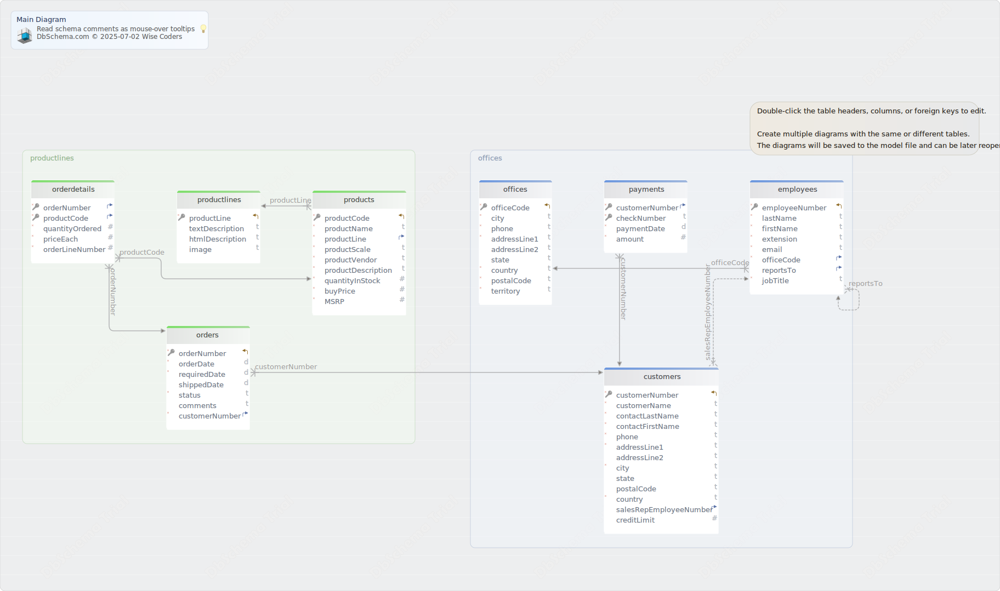

#Main Diagram
Generated using [DbSchema](https://dbschema.com)

### Main Diagram

### Table Default.customers 
|Idx |Name |Data Type |
|---|---|---|
| * &#128273;  &#11019; | customerNumber| INTEGER  |
| * | customerName| TEXT  |
| * | contactLastName| TEXT  |
| * | contactFirstName| TEXT  |
| * | phone| TEXT  |
| * | addressLine1| TEXT  |
|  | addressLine2| TEXT  |
| * | city| TEXT  |
|  | state| TEXT  |
|  | postalCode| TEXT  |
| * | country| TEXT  |
| &#11016; | salesRepEmployeeNumber| INTEGER  |
|  | creditLimit| NUMERIC(10,2)  |

##### Indexes 
|Type |Name |On |
|---|---|---|
| &#128273;  | pk\_customers | ON customerNumber|

##### Foreign Keys
|Type |Name |On |
|---|---|---|
|  | FK_customers employees | ( salesRepEmployeeNumber ) ref [Default.employees](#employees) (employeeNumber) |

### Table Default.employees 
|Idx |Name |Data Type |
|---|---|---|
| * &#128273;  &#11019; | employeeNumber| INTEGER  |
| * | lastName| TEXT  |
| * | firstName| TEXT  |
| * | extension| TEXT  |
| * | email| TEXT  |
| * &#11016; | officeCode| TEXT  |
| &#11016; | reportsTo| INTEGER  |
| * | jobTitle| TEXT  |

##### Indexes 
|Type |Name |On |
|---|---|---|
| &#128273;  | pk\_employees | ON employeeNumber|

##### Foreign Keys
|Type |Name |On |
|---|---|---|
|  | FK_employees employees | ( reportsTo ) ref [Default.employees](#employees) (employeeNumber) |
|  | FK_employees offices | ( officeCode ) ref [Default.offices](#offices) (officeCode) |

### Table Default.offices 
|Idx |Name |Data Type |
|---|---|---|
| * &#128273;  &#11019; | officeCode| TEXT  |
| * | city| TEXT  |
| * | phone| TEXT  |
| * | addressLine1| TEXT  |
|  | addressLine2| TEXT  |
|  | state| TEXT  |
| * | country| TEXT  |
| * | postalCode| TEXT  |
| * | territory| TEXT  |

##### Indexes 
|Type |Name |On |
|---|---|---|
| &#128273;  | pk\_offices | ON officeCode|

### Table Default.orderdetails 
|Idx |Name |Data Type |
|---|---|---|
| * &#128273;  &#11016; | orderNumber| INTEGER  |
| * &#128273;  &#11016; | productCode| TEXT  |
| * | quantityOrdered| INTEGER  |
| * | priceEach| NUMERIC(10,2)  |
| * | orderLineNumber| INTEGER  |

##### Indexes 
|Type |Name |On |
|---|---|---|
| &#128273;  | pk\_orderdetails | ON orderNumber, productCode|

##### Foreign Keys
|Type |Name |On |
|---|---|---|
|  | FK_orderdetails orders | ( orderNumber ) ref [Default.orders](#orders) (orderNumber) |
|  | FK_orderdetails products | ( productCode ) ref [Default.products](#products) (productCode) |

### Table Default.orders 
|Idx |Name |Data Type |
|---|---|---|
| * &#128273;  &#11019; | orderNumber| INTEGER  |
| * | orderDate| DATE  |
| * | requiredDate| DATE  |
|  | shippedDate| DATE  |
| * | status| TEXT  |
|  | comments| TEXT  |
| * &#11016; | customerNumber| INTEGER  |

##### Indexes 
|Type |Name |On |
|---|---|---|
| &#128273;  | pk\_orders | ON orderNumber|

##### Foreign Keys
|Type |Name |On |
|---|---|---|
|  | FK_orders customers | ( customerNumber ) ref [Default.customers](#customers) (customerNumber) |

### Table Default.payments 
|Idx |Name |Data Type |
|---|---|---|
| * &#128273;  &#11016; | customerNumber| INTEGER  |
| * &#128273;  | checkNumber| TEXT  |
| * | paymentDate| DATE  |
| * | amount| NUMERIC(10,2)  |

##### Indexes 
|Type |Name |On |
|---|---|---|
| &#128273;  | pk\_payments | ON customerNumber, checkNumber|

##### Foreign Keys
|Type |Name |On |
|---|---|---|
|  | FK_payments customers | ( customerNumber ) ref [Default.customers](#customers) (customerNumber) |

### Table Default.productlines 
|Idx |Name |Data Type |
|---|---|---|
| * &#128273;  &#11019; | productLine| TEXT  |
|  | textDescription| TEXT  |
|  | htmlDescription| ENUM  |
|  | image| ENUM  |

##### Indexes 
|Type |Name |On |
|---|---|---|
| &#128273;  | pk\_productlines | ON productLine|

### Table Default.products 
|Idx |Name |Data Type |
|---|---|---|
| * &#128273;  &#11019; | productCode| TEXT  |
| * | productName| TEXT  |
| * &#11016; | productLine| TEXT  |
| * | productScale| TEXT  |
| * | productVendor| TEXT  |
| * | productDescription| TEXT  |
| * | quantityInStock| INTEGER  |
| * | buyPrice| NUMERIC(10,2)  |
| * | MSRP| NUMERIC(10,2)  |

##### Indexes 
|Type |Name |On |
|---|---|---|
| &#128273;  | pk\_products | ON productCode|

##### Foreign Keys
|Type |Name |On |
|---|---|---|
|  | FK_products productlines | ( productLine ) ref [Default.productlines](#productlines) (productLine) |

